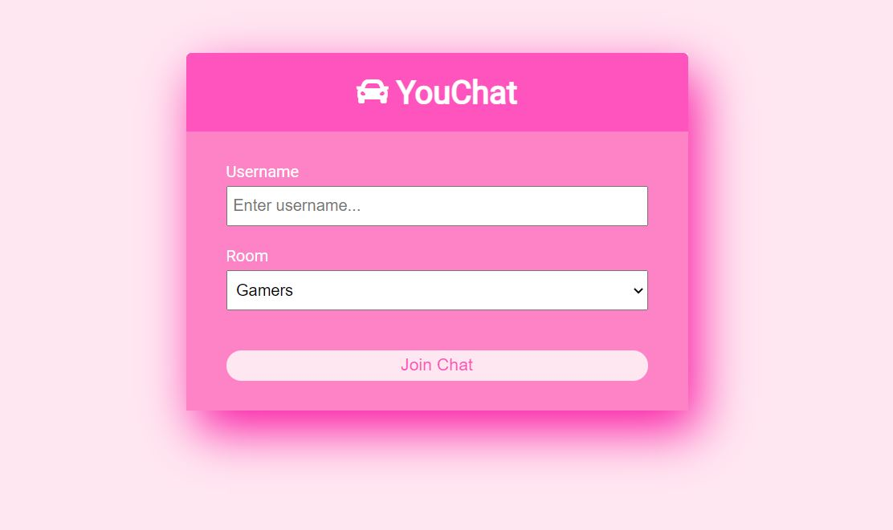

# Basic-chatapp

This is a basic chat app made using socket.io with a features to chat under different rooms with different users.

## Technologies used

* NodeJS
* ExpressJs
* Moment
* Socket.io

## Screenshot

## Live Demo
https://you-chat-app.herokuapp.com/
